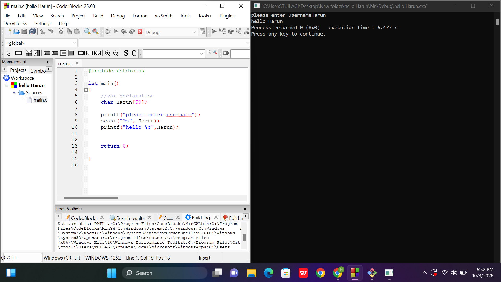

# C Username Greeting Project

This project is a simple C application that prompts the user to enter a username and outputs a personalized greeting.

---

### 📷 Program Execution

---

### 📝 Code Explanation

* **`#include <stdio.h>`**: Includes the standard input-output library necessary for using `printf` and `scanf`
* **`char Harun[50];`**: Declares a character array (string buffer) named `Harun` capable of holding up to 50 characters
* **`printf("please enter username");`**: Displays a prompt on the screen asking the user to input their name
* **`scanf("%s", Harun);`**: Reads the string entered by the user from the console and stores it in the `Harun` variable
* **`printf("hello %s", Harun);`**: Outputs "hello " followed by the stored username to the screen
* **`return 0;`**: Signals that the program has executed successfully
